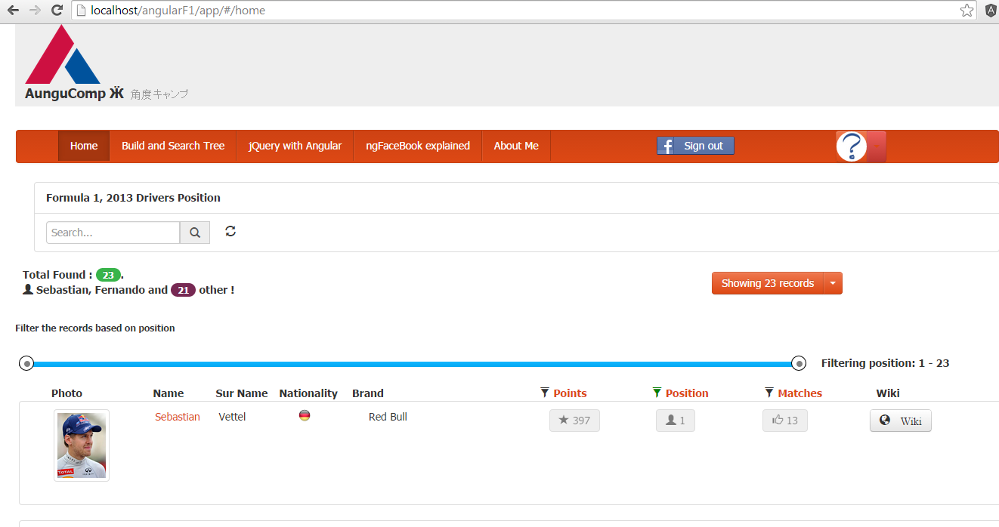

This is AngularF1 demo.
=======================

Note : Not a Node js based project.

Installation:
==================

Pull the project to your apache working directory, Ex: in ubuntu, the working directory is (/var/www/)
So the application should be like '/var/www/angularF1

Then opening the project by following the url in your favorite browser : http://localhost/angularF1/app/

Login Credentials :
UserName/Password : demo/ demo123

Home Page 

